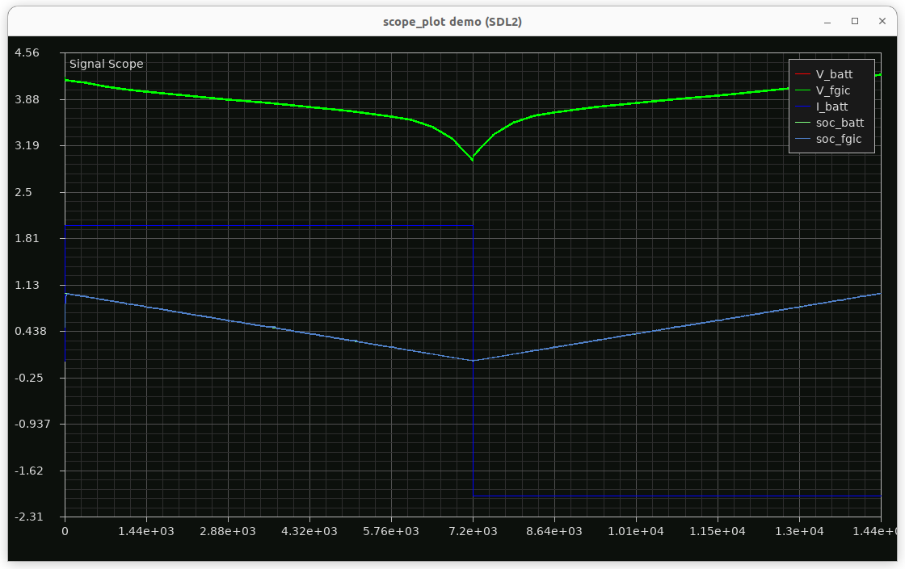

# si_anode
Silicon Anode FGIC

This project runs a battery simulation that includes three entities:

- batt: simulates the dynamic of a battery based on equivalent circuit model or electrochemical model
- fgic: fuel gauge IC with BMS functions that predicts accurate SOC and SOH
- system: the system that represents load and charger

## Build
```
make                # build 
make clean          # clean the build
```

## Run

```
./app   

> run paused at  t=0.000000

> ls
ls:	list commands (usage:ls)
run:	run simulation for a duration (usage:run <secs>)
set:	set param value (usage:set <param> <value>)
show:	show param value (usage:show | show <param>)
log:	log data to file (usage:log <start <file> <data0> <data1> ...> | <stop>)
plot:	plot a csv file (usage:plot <file>)
cd:	cd command (usage:cd <here | there>)
 
```
(note: current 'cd' does not do anything, just a place holder for future features)

## Example Constant Current Run

First set the system discharging current at 2.0A then start logging data to `cc.csv` and run the simulation up to t=50000 sec.
```
> set I_sys 2.0
> log start cc.csv V_batt V_fgic soc_batt soc_fgic I_batt       
> run 50000 
```

But the simullation will stop at t=7200 sec because battery has reached SOC=0.

```
run paused at t=7200.000000
```

Now we will reverse current direction for charging and try to run the simulation up to t=50000 sec. This time the simulation stops at t=144000 sec because battery is full (SOC=1.0).  We now stop logging so the CSV file can close.
 
```
> set I_sys -2.0
> run 50000
> run paused at t=14400.000000
> log stop
```

## Plot Log File
The saved log file is in CSV format and can be plotted by:
``` 
> plot cc.csv

```

You should see the below chart popping up:



